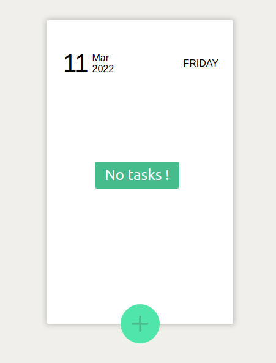
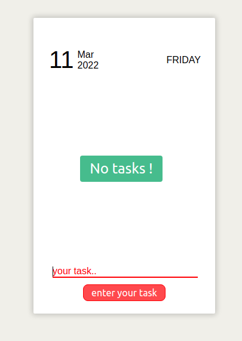
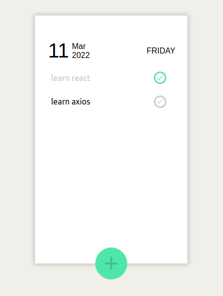

# react-practical-3

## added functionality to Todo web app
1. all tasks are stored in local storage.
2. tasks will be updated if added any new.
3. tasks will persist even if you refresh the window.
4. press add button to show input field.
5. press Enter to add task to list.
6. press Esc to hide input field.

## Getting Started

1. Setup React

2. Clone the repo</br>

```sh
  git clone https://github.com/smeekas/react-practical3/
```

3. change directory</br>

```sh
  cd ./react-practical3
```

4. Install dependency</br>

```sh
  npm install
```

5. Run the app</br>

```sh
  npm start
```

6. Production build</br>

```sh
  npm run build
```

## App preview


